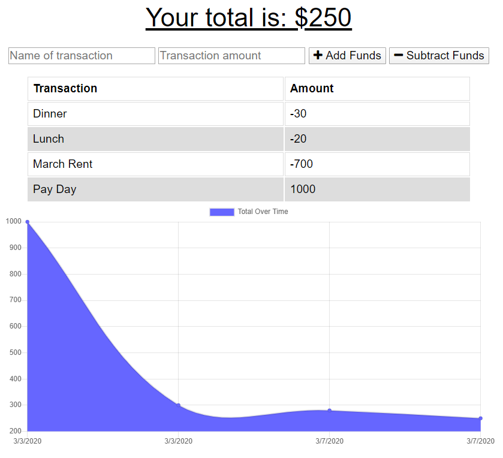

# Homework Week 18 - Budget Tracker

This budget tracker application is created with a Mongo database and Mongoose schema. The routes are handled with Express and pulls/processes recorded transaction data to display on the front end of the application. When the application is online, transaction data saves to mongoDB. When the application is offline, transaction data saves to IndexedDB. Once the applications is online again, the IndexedDB data saves to mongoDB.

## User Story

```
AS A person constantly on the go
I WANT to be able to track my withdrawals and deposits with or without a data/internet connection
SO THAT my account balance is accurate 
```

## Composition of Application

On server start (or in the deployed application), the user sees any existing budget data as line items, as well as in graph form (my Chart). They can add new deposits or withdrawal items (by entering a name and dollar amount for the transaction and choosing to add or subtract when finalizing the submission), and the net dollar amount will update at the top of the page. 

The user will be able to add expenses and deposits to their budget with or without a connection. 

Offline functionality:

  * Expense/deposit entries are added to local storage (saved to IndexedDB as key value pairs). Existing and new transaction data will continue to display and total on the HTML page.

When brought back online:

  * Offline entries will be added to the connected Mongo database and cleared from indexedDB.

## Process

The server.js file is first set up to require the dependencies and model, and to create the PORT and the mongoose connection to MongoDB. 

The transactions.js file in the models folder includes the mongoose schema/model. The front end html, css and javascript code reside in the public folder. The db.js file that handles the IndexedDB functionality is also included in the public folder.

The web app manifest provides information about the application in a JSON text file, necessary for the web app to be downloaded and be presented to the user similarly to a native app (e.g., be installed on the homescreen of a device, providing users with quicker access and a richer experience).

The service-worker.js file is compiled to allow caching of the webpage.

The dependencies for the application are listed in the package.json file and a gitignore file is used to to skip and prevent upload of the node_modules folder to GitHub. 

Heroku deployment required the setup of the mLab MongoDB add on.

## Deployment

The completed application is available for download on Github: 
https://github.com/jenjch/budgetTracker

Image of the application:



The deployed application is hosted on Heroku:
https://budget-tracker-030720.herokuapp.com/ 

## Acceptance Criteria

All requirements are met for application deployment. Feedback on improvements is appreciated.

## License

MIT license Copyright (c) 2020 Jenny Chen 
https://choosealicense.com/licenses/mit/ 